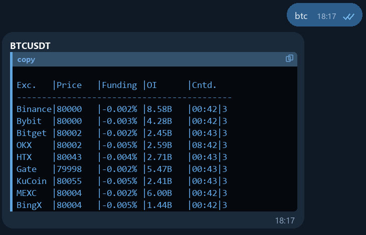
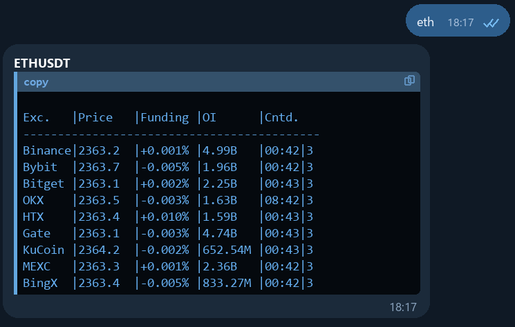
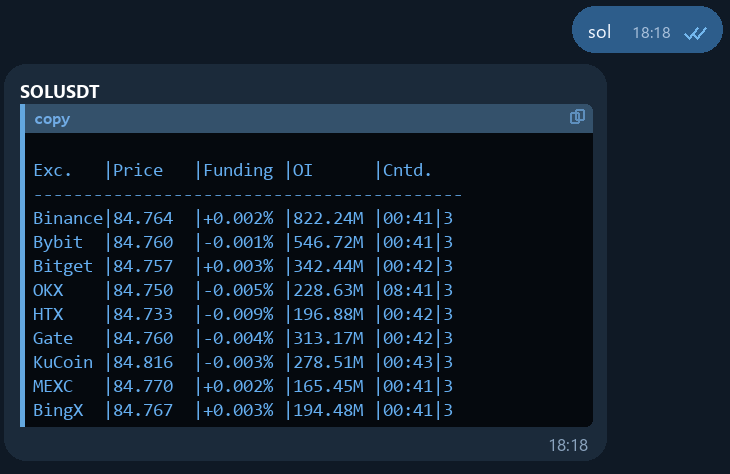
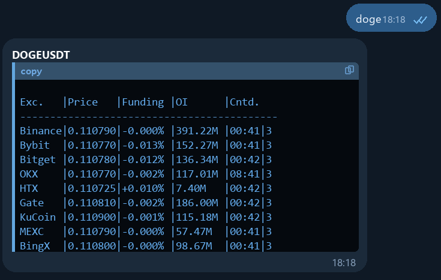

# Price Token Bot

Telegram bot for quickly checking perpetual futures market data for a token across several exchanges.
It returns price, funding rate, open interest, and time left until the next funding event in a compact Telegram message.

Russian version: [README.ru.md](README.ru.md)

## Features

- Supports tickers like `BTC`, `ETH`, `DOGE`, `PEPE`, and `1INCH`
- Aggregates data from Binance, Bybit, Bitget, OKX, HTX, Gate, KuCoin, MEXC, and BingX
- Displays exchanges in a fixed user-friendly order: Binance, Bybit, MEXC, Gate, then the rest
- Separates "token not found" from temporary upstream API failures
- Handles non-text Telegram messages without crashing
- Keeps a short in-memory cache to reduce duplicate exchange requests

## Example

<p align="center">
  
  
  
  
</p>

Input:

```text
BTC
```

Output:

```text
BTCUSDT
Exc.   |Price   |Funding |OI      |Cntd.
-------------------------------------------
Binance|93650   |+0.010% |18.20B  |03:44|3
Bybit  |93648   |+0.008% |15.10B  |03:44|3
MEXC   |93645   |+0.009% |4.20B   |03:44|3
Gate   |93640   |+0.007% |3.10B   |03:44|3
Bitget |93639   |+0.006% |2.84B   |03:44|3
OKX    |93660   |+0.011% |8.25B   |11:44|3
HTX    |93642   |+0.005% |1.87B   |03:44|3
KuCoin |93655   |+0.004% |1.64B   |03:44|3
BingX  |93647   |+0.006% |1.21B   |03:44|3

Answered exchanges: 9/9
Temporarily unavailable: 0
```

## Quick Start

### 1. Create a virtual environment

```bash
python3 -m venv .venv
source .venv/bin/activate
pip install -r requirements.txt
```

### 2. Configure the bot token

```bash
cp .env.example .env
```

Then put your Telegram bot token into `.env`.

### 3. Run the bot

```bash
python3 bot.py
```

## Testing

```bash
python3 -m unittest discover -s tests -v
```

## Project Layout

- `bot.py` - Telegram handlers and bot entrypoint
- `config.py` - environment loading
- `exchanges.py` - exchange integrations and aggregation logic
- `tests/` - lightweight regression tests

## Notes

- This bot uses public exchange APIs, so temporary failures and rate limits can happen.
- The repository intentionally does not include a real bot token, local logs, or a virtual environment.

## License

MIT
