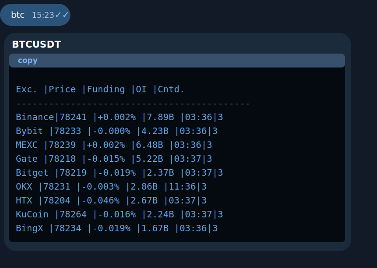
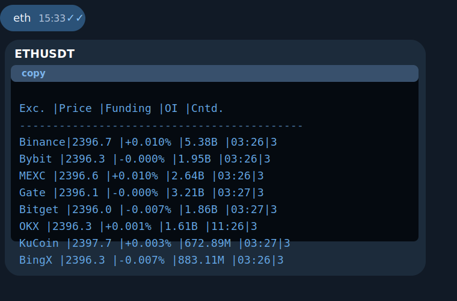
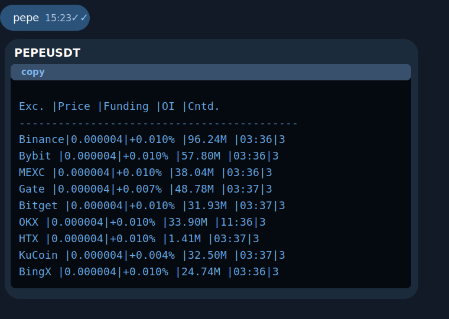

# Price Token Bot

Telegram-бот для быстрого просмотра данных по perpetual futures сразу с нескольких бирж.
Бот возвращает цену, funding rate, open interest и время до следующего начисления funding в компактном сообщении в Telegram.

English version: [README.md](README.md)

## Возможности

- Поддерживает тикеры вроде `BTC`, `ETH`, `DOGE`, `PEPE` и `1INCH`
- Собирает данные с Binance, Bybit, Bitget, OKX, HTX, Gate, KuCoin, MEXC и BingX
- Показывает биржи в фиксированном порядке: Binance, Bybit, MEXC, Gate, затем остальные
- Разделяет ситуации "тикер не найден" и "временная ошибка API биржи"
- Не падает на нетекстовых сообщениях в Telegram
- Использует короткий in-memory кэш, чтобы не дёргать одни и те же API лишний раз

## Пример

<p align="center">
  
  
  
</p>

Вход:

```text
BTC
```

Выход:

```text
BTCUSDT
Exc.   |Price   |Funding |OI      |Cntd.
-------------------------------------------
Binance|93650   |+0.010% |18.20B  |03:44|3
Bybit  |93648   |+0.008% |15.10B  |03:44|3
MEXC   |93645   |+0.009% |4.20B   |03:44|3
Gate   |93640   |+0.007% |3.10B   |03:44|3
Bitget |93639   |+0.006% |2.84B   |03:44|3
OKX    |93660   |+0.011% |8.25B   |11:44|3
HTX    |93642   |+0.005% |1.87B   |03:44|3
KuCoin |93655   |+0.004% |1.64B   |03:44|3
BingX  |93647   |+0.006% |1.21B   |03:44|3

Ответило бирж: 9/9
Временно недоступно: 0
```

## Зачем этот проект

- Подходит как лёгкий market snapshot бот без API-ключей бирж
- Может быть основой для более сильного crypto analytics бота
- Достаточно маленький, чтобы быстро разобраться в коде, и при этом достаточно практичный для публичного pet project

## Быстрый старт

### 1. Создай виртуальное окружение

```bash
python3 -m venv .venv
source .venv/bin/activate
pip install -r requirements.txt
```

### 2. Настрой токен бота

```bash
cp .env.example .env
```

После этого вставь свой Telegram bot token в `.env`.

### 3. Запусти бота

```bash
python3 bot.py
```

## Тесты

```bash
python3 -m unittest discover -s tests -v
```

## Структура проекта

- `bot.py` - Telegram handlers и точка входа
- `config.py` - загрузка конфигурации из окружения
- `exchanges.py` - интеграции с биржами и агрегация результатов
- `tests/` - лёгкие регрессионные тесты

## Идеи для развития

- Добавить альтернативные режимы сортировки по цене, funding или open interest
- Добавить команды `/help` и `/exchanges`
- Показывать спред между лучшей и худшей ценой
- Добавить Docker и пример systemd unit
- Добавить структурированные логи для удобного мониторинга

## Заметки

- Бот использует публичные API бирж, поэтому временные ошибки и rate limits возможны
- В репозиторий специально не включены реальный токен, локальные логи и виртуальное окружение

## Лицензия

MIT
